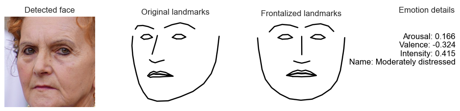

# Facial expression analysis for DLIB
A set of Python classes for estimating **dimensional emotions (i.e. Arousal, Valence, Intensity and emotion labels)** and **frontalized ladmarks**, from 2D facial landmarks extracted by the **DLIB** libary.





# Usage
The classes and scripts should work directly "out of the box". Emotion and frontalization models have been learnt and are provided, as well as a dataset of landmarks for experimentation. There is also training code in order to retrain with your own data, if needed. 
1. **Detect faces** and **landmarks** using DLIB.
2. **Instantiate an emotion class object** and pass the landmarks object to it. 
3. Get back a dictionary with: estimations of **Arousal, Valence, Intensity**, a string with a **description of the emotion**, e.g. moderately happy, slightly distressed etc., as well as the **frontalized facial landmarks**.


# Contents:
```tree
│   environment_requirements.yml                       [Environment file for the required version of libraries]
├── source                                             [Directory: Source code]
│   ├── emotions_dlib.py                               [The main set of classes for emotion estimation, feature generation and landmark frontalization] 
│   ├── Extract_features_and_train_model.ipynb         [Jupyter notebook demonstrating end-to-end data loading, feature generation, analysis and model training]
│   ├── extract_features.py                            [Independent script for generating features]
│   ├── train_emotions.py                              [Independent script for training emotion models, based on generated features]
│   ├── example_test_emotions_singleimage.py           [Example of applying emotion estimation on faces from a single image]
│   ├── example_test_realtime_emotions_AVspace.py      [Example of real-time emotion estimation on faces from a camera (AVspace + time graphs)]
│   └── example_test_realtime_emotions_bars.py         [Example of real-time emotion estimation on faces from a camera (bar charts)]
├── models                                             [Directory: Models]
│   ├── shape_predictor_68_face_landmarks.dat          [DLIB facial landmark model] 
│   ├── model_frontalization.npy                       [Frontalization facial landmark model] 
│   └── model_emotion_pls=30_fullfeatures=False.joblib [Emotion pretrained model]
└── data                                               [Directory: dataset]
    ├── Morphset.csv                                   [Dataset of anonymized facial landmarks with morphed expressions and emotion annotations]
    └── images                                         [Directory: sample test images and examples]
```


# Dependences
- dlib
- opencv
- numpy
- scikit-learn 0.23.1
- imageio
- matplotlib
- pandas
- Python 3.6


# Python environment
The code is based on Python 3.6 and scikit-learn 0.23.1. You can recreate the same environment that was used to develop this project, buy running the following command line inside the python directory, where the ```environment_requirements.yml``` is located. 

```conda create --name <your_own_environment_name> --file=environment_requirements.yml```

Once you create your new environment from the environment_requirements.yml, you can activate it with the following command. After that, you will be able to run the code.

```conda activate <your_own_environment_name>```

## More details about the Python environment
The above instructions are enough for your to recreate the correct environment and run the code. If you want however to build the environment from scratch, keep in mind that the project was built with scikit-learn=0.23.1, which has a dependency to Python=3.6. So you should first create your environment, install Python 3.6, install scikit-learn=0.23.1 and then the rest of packages.

- ```conda create --name <your_own_environment_name>```
- ```conda install python=3.6```
- ```conda install scikit-learn=0.23.1```
- ```conda install -c anaconda opencv```
- ```conda install -c conda-forge dlib```
- Install any other remaining packages...

Ofcourse, it is possible to upgrade the project to a more recent version of scikit-learn. However this would require some minor code changes and probably retraining the model with the newer version of the PLS regressor. 

# Citation
If you use this code in your research please cite the following paper:
1. [V. Vonikakis, D. Neo Yuan Rong, S. Winkler. (2021). MorphSet: Augmenting categorical emotion datasets with dimensional affect labels using face morphing. Proc ICIP2021, Alaska USA, September 2021.](https://arxiv.org/abs/2103.02854)
2. [Vonikakis, V., S. Winkler. (2021). Efficient Facial Expression Analysis For Dimensional Affect Recognition Using Geometric Features.](https://arxiv.org/abs/2106.07817)
3. [V. Vonikakis, S. Winkler. (2020). Identity Invariant Facial Landmark Frontalization for Facial Expression Analysis. Proc. ICIP2020, Abu Dhabi, October 2020.](https://stefan.winkler.site/Publications/icip2020a.pdf)
